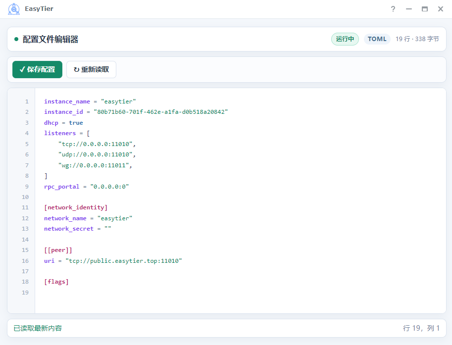

# Synology DSM Configuration Editor

[简体中文](README_zh-CN.md)

A dependency-free Shell CGI configuration editor for Synology DSM 7 packages. The main branch follows DSM's official locale and includes 21 language packs.



## Editions

The repository provides two editions with the same editor, security, backup, port, and restart features:

- `main` — Multilingual edition. Uses DSM's official `texts` locale, includes 21 editor language packs, and falls back to English.
- `zh_cn` — Simplified Chinese edition. Uses embedded Simplified Chinese text and does not include `texts`, `i18n`, or language switching.

Choose `main` for public packages or users with different DSM languages. Choose `zh_cn` for a smaller, fixed Chinese interface. Do not mix UI files from the two branches.

## Features

- DSM Cookie authentication with `admin` or `authenticated` access mode
- Read, edit, save, reload, line numbers, and cursor position
- Lightweight highlighting for TOML, YAML, JSON, INI, env, and Shell
- Three rotating backups: `.bak.1` is newest
- Atomic save lock and same-directory temporary-file replacement
- Fixed service port or numeric port read from the configuration file
- Read-only Open Service button with an optional path
- Package status and optional `start-stop-status stop` / `start` after saving
- Official DSM `texts` locale integration with English fallback
- 2 MiB file limit, CSP, same-origin save checks, and HTML escaping

## File responsibilities

```text
ui/
├─ config          DSM desktop registration: app ID, title, icon, version
├─ Main.js         DSM window class and iframe URL
├─ gettoken.html   Retrieves SynoToken before opening the editor
├─ index.cgi       Editor page and read/write API
├─ editor.conf     Per-package configuration path, port, access, restart
├─ texts/          Official DSM desktop locale resources
├─ i18n/           Editor language packs
└─ images/         DSM desktop icons from 16 to 256 pixels
```

`index.cgi` and `gettoken.html` are generic. To use the UI in another package, update the following package-specific files.

## 1. Edit `ui/editor.conf`

The included EasyTier configuration is the working template:

```ini
PACKAGE_NAME=EasyTier
CONFIG_FILE=/var/packages/EasyTier/var/config.toml
DEFAULT_PORT=
PORT_CONFIG_KEY=
OPEN_PATH=/
ACCESS_MODE=admin
RESTART_MODE=lifecycle
RESTART_SCRIPT=
RESTART_ARGS=
```

- `PACKAGE_NAME`: exact package name from SPK `INFO`.
- `CONFIG_FILE`: absolute path to a regular configuration file. Symbolic links are not supported.
- `DEFAULT_PORT`: optional fixed numeric port. Leave empty to hide the Open Service button unless `PORT_CONFIG_KEY` succeeds.
- `PORT_CONFIG_KEY`: optional configuration key such as `webServer.port`. Supports common `key = 7500`, `key = "7500"`, `key: 7500`, and quoted forms.
- `OPEN_PATH`: path appended after the port, for example `/` or `/xxx.html`; it must start with `/`.
- `ACCESS_MODE`: `admin` or `authenticated`.
- `RESTART_MODE`: `lifecycle`, `script`, or `none`.
- `lifecycle`: runs `/var/packages/<PACKAGE_NAME>/scripts/start-stop-status stop`, then `start`.
- `script`: runs the server-side `RESTART_SCRIPT` with `RESTART_ARGS`.

## 2. Edit `ui/config`

Keep the JSON structure but replace the EasyTier class, title, description, icon path, and version.

The `version` must match the program version in the SPK `INFO`; do not use a fixed editor version. `dsmappname` in `INFO` must match the app ID, for example `SYNO.SDS.EasyTier.Instance`.

```json
{
    "Main.js": {
        "SYNO.SDS.EasyTier.Instance": {
            "type": "app",
            "version": "1.3.0",
            "desc": "EasyTier",
            "icon": "images/icon_{0}.png",
            "title": "EasyTier",
            "allowMultiInstance": false,
            "appWindow": "SYNO.SDS.EasyTier.Main",
            "depend": []
        },
        "SYNO.SDS.EasyTier.Main": {
            "type": "lib",
            "title": "EasyTier",
            "icon": "images/icon_{0}.png",
            "depend": []
        }
    }
}
```

## 3. Edit `ui/Main.js`

Replace all EasyTier identifiers with the new package class and change the iframe path:

```text
SYNO.SDS.EasyTier.Instance
SYNO.SDS.EasyTier.Main
/webman/3rdparty/EasyTier/gettoken.html
```

The class names must match `ui/config` and SPK `INFO`. The `/webman/3rdparty/<name>/` path must match the path installed by the package.

## 4. Replace `ui/images`

Replace the complete icon set while keeping these filenames:

```text
icon_16.png   icon_24.png   icon_32.png   icon_48.png
icon_64.png   icon_72.png   icon_96.png   icon_128.png
icon_256.png
```

Do not reuse EasyTier icons when publishing another package.

## Installation requirements

- Install the whole `ui` directory into the package target.
- Map it to `/webman/3rdparty/<package>/`.
- Set `index.cgi` to executable:

```sh
chmod 755 /var/packages/YourPackage/target/ui/index.cgi
```

- The package account must be able to read and write the configuration directory.
- Lifecycle mode requires permission to control the package process.

## Checklist

- `INFO package`, `INFO dsmappname`, `ui/config`, and `Main.js` identifiers agree.
- `ui/config` version matches the SPK program version.
- `editor.conf` points to the correct package and configuration file.
- The icon set belongs to the package.
- The configuration file and directory permissions allow backups and temporary files.
- Test signed-out, standard-user, administrator, save, backup, status, and restart behavior on DSM.

## Languages

The included DSM codes are `chs`, `cht`, `csy`, `dan`, `enu`, `fre`, `ger`, `hun`, `ita`, `jpn`, `krn`, `nld`, `nor`, `plk`, `ptb`, `ptg`, `rus`, `spn`, `sve`, `tha`, and `trk`. The locale comes from DSM `texts`; the editor does not inspect browser language.

## Notes

- Keep `ACCESS_MODE=admin` unless ordinary signed-in users must edit the configuration.
- Saving does not validate TOML, YAML, or other configuration syntax.
- A failed restart does not roll back a successful save.
- If DSM forcibly terminates the CGI during saving, remove the hidden `.editor.lock` directory beside the configuration file before retrying.

See [SECURITY.md](SECURITY.md) for the security boundary.
